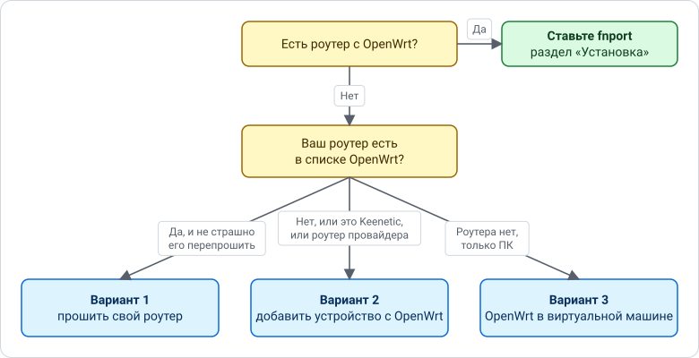
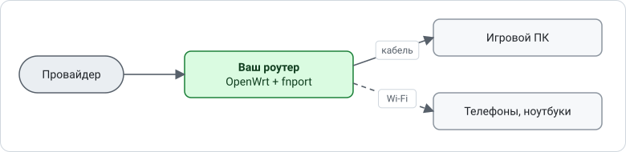
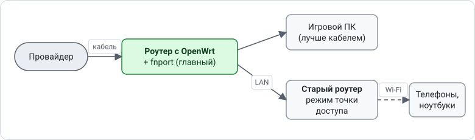
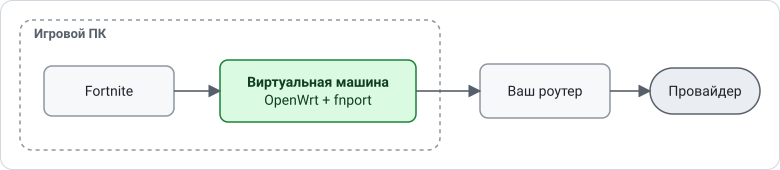

# Нет роутера с OpenWrt?

fnport работает только на устройстве с OpenWrt, через которое игровой ПК выходит в интернет.
**На самом Windows-ПК его не запустить:** чтобы выбирать исходящий порт игры, нужен сетевой драйвер,
а такие драйверы (тот же WinDivert у запрета) Easy Anti-Cheat выгружает. Поэтому нужно отдельное
устройство с OpenWrt, но совсем не обязательно выбрасывать свой роутер.

Какой вариант подходит вам:

## Вариант 1. Прошить свой роутер в OpenWrt

1. **Проверьте модель.** Откройте [firmware-selector.openwrt.org](https://firmware-selector.openwrt.org/)
   и введите модель роутера с наклейки на дне, включая ревизию (например, `v2`). Нужна версия 24.10 или новее.
   Если модели нет, этот вариант не подойдёт: переходите к варианту 2.
2. **Прочитайте страницу своей модели** в [списке устройств OpenWrt](https://openwrt.org/toh/start).
   Способ прошивки у разных моделей разный: где-то хватает загрузить файл в веб-интерфейсе роутера,
   а где-то нужны особые шаги. Делайте строго по инструкции для своей модели.
3. **Перепишите настройки интернета** со старой прошивки: тип подключения (PPPoE, IPoE/DHCP),
   логин и пароль PPPoE из договора с провайдером. Они понадобятся после прошивки.
4. **Прошейте роутер** по инструкции из шага 2.
5. В LuCI (`http://192.168.1.1`) задайте пароль, настройте интернет (**Сеть → Интерфейсы → wan**) и Wi-Fi.
6. Поставьте fnport по разделу [«Установка»](../README.md#установка).

> Прошивка — это риск: при ошибке роутер может перестать включаться, гарантия обычно теряется.
> Если роутер нужен для работы или учёбы и запасного нет, лучше вариант 2.

## Вариант 2. Добавить устройство с OpenWrt, свой роутер оставить

Подходит для Keenetic, роутеров провайдера и любых моделей без OpenWrt.
Понадобится недорогой роутер, который поддерживает OpenWrt (fnport проверялся на **Xiaomi AX3000T**),
или мини-ПК / Raspberry Pi с двумя сетевыми портами. Проверить модель перед покупкой можно так же,
через [firmware-selector.openwrt.org](https://firmware-selector.openwrt.org/). Хватит 128 МБ памяти.

**2а. Рекомендуется: OpenWrt — главный роутер, старый раздаёт Wi-Fi**

1. **Узнайте настройки интернета** в старом роутере: тип подключения и, если это PPPoE, логин и пароль.
   В Keenetic они на странице **Интернет → Проводной**. Если провайдер привязывает доступ к MAC-адресу,
   запишите MAC старого роутера.
2. **Подготовьте роутер с OpenWrt** (прошейте по шагам из варианта 1, если он не с OpenWrt «из коробки»)
   и настройте в нём интернет: **Сеть → Интерфейсы → wan**. Для PPPoE выберите протокол «PPPoE»
   и введите логин и пароль. Если нужен MAC старого роутера, укажите его там же
   («Дополнительные настройки → Переопределить MAC-адрес»).
3. **Переключите старый роутер в режим точки доступа**, чтобы он только раздавал Wi-Fi:
   - Keenetic: **Общие настройки → Изменить режим работы → Точка доступа/Ретранслятор**.
     У моделей с переключателем на корпусе — переключателем
     ([инструкция Keenetic](https://support.keenetic.ru/eaeu/giga/kn-1010/ru/16715-system-operating-modes.html));
   - другие роутеры: режим «Точка доступа» / «Access Point», если он есть. Если нет, выключите на старом
     роутере DHCP-сервер и подключайте его к OpenWrt только через LAN-порт, не через WAN.
4. **Переподключите кабели:** кабель провайдера — в WAN-порт роутера с OpenWrt; LAN-порт OpenWrt — в любой
   порт старого роутера; игровой ПК — кабелем в OpenWrt (можно и в старый роутер, трафик всё равно пойдёт через OpenWrt).
   Названия и пароли Wi-Fi останутся прежними.
5. Поставьте fnport по разделу [«Установка»](../README.md#установка) и добавьте в «Устройства» IP игрового ПК.

**2б. Проще: OpenWrt за старым роутером**

Если не хочется трогать настройки интернета, роутер с OpenWrt можно поставить после старого:

Кабель от LAN-порта старого роутера идёт в WAN-порт роутера с OpenWrt, игровой ПК подключается к OpenWrt.
Учтите:
- старый роутер ещё раз меняет адреса (двойной NAT). fnport сработает, только если старый роутер
  сохраняет исходящий порт. **Проверено:** обычный роутер (не OpenWrt) и роутер на OpenWrt порт сохраняют,
  игра через такую цепочку загружается. Какой-нибудь роутер может и менять порт: если fnport пишет,
  что порт найден, а соединения всё равно замерзают, дело, скорее всего, в этом;
- до ТСПУ дальше: прибавьте к **TTL фейка** по 1 за каждый роутер между fnport и провайдером
  (один старый роутер — `fake_ttl` = 4, два — 5);
- если ваш роутер проверен в такой схеме, напишите в issues модель — добавим в список.

## Вариант 3. OpenWrt в виртуальной машине на игровом ПК

Можно запустить OpenWrt (образ для x86-64) в VirtualBox или Hyper-V и направить интернет ПК через неё.
**Проверено:** fnport в виртуальной машине пропускал игру у двух разных провайдеров, в том числе за обычным
роутером.
Но этот вариант сложнее остальных: виртуальную машину нужно держать включённой во время игры,
TTL фейка нужно поставить на 1 больше (`fake_ttl` = 4: виртуальная машина на хоп дальше от провайдера),
а при ошибке в настройках ПК остаётся без интернета. Пошаговая инструкция и готовый образ
виртуальной машины в планах.

## Keenetic без второго устройства

Отдельная версия fnport для Keenetic (через Entware) в планах. На Keenetic нет `nftables`,
на которых работает fnport, поэтому её придётся переделать. Если у вас Keenetic и вы готовы помочь
с проверкой, напишите в issues.
